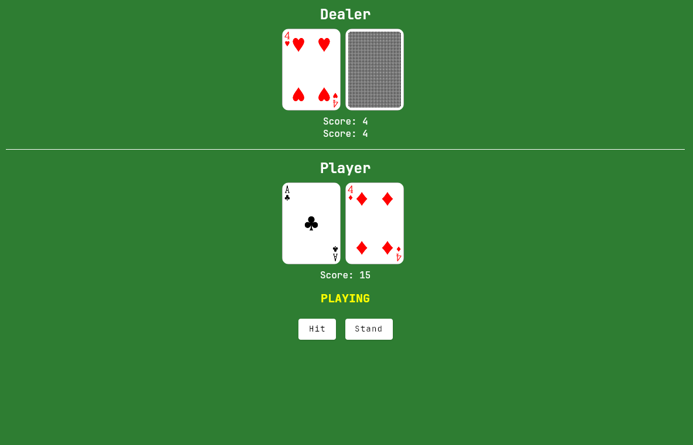

# Compose Multiplatform Blackjack

This is a multi-modular Kotlin and Compose Multiplatform app for the popular casino banking game.

## Features
- Working Blackjack game with basic animations
- Choose to hit or stand against the dealer
- Works on Desktop

___

## Planned features:
### 0.2.0:
- Restart without quitting app
- Betting

### 0.3.0:
- Animation improvements
- Stability improvements
- Bugfixes
- Testing

### 0.4.0
- Android and Web support (multi-platform)

### 0.5.0
- Multiple seats support

### 1.0.0
- UI redesign (Material3)
- Local multiplayer
- Local saving support
- Statistics
- Sounds

### Near future:
- AI players
- Perfect Pairs rules
- Customize rules
- Difficulty

### Future:
- Online multiplayer
- Simulation with different rules to see winning %
___

## Tech Stack
- [Kotlin Multiplatform](https://kotlinlang.org/lp/multiplatform/)
- [Compose Multiplatform](https://www.jetbrains.com/lp/compose-multiplatform/)
- [Kotlin Coroutines](https://github.com/Kotlin/kotlinx.coroutines)
- [Koin](https://insert-koin.io/)
- [Jetpack ViewModel](https://developer.android.com/topic/libraries/architecture/viewmodel)